## Keypad

---

| Description | Image                                          |
|:----------- |:----------------------------------------------:|
| Image       | 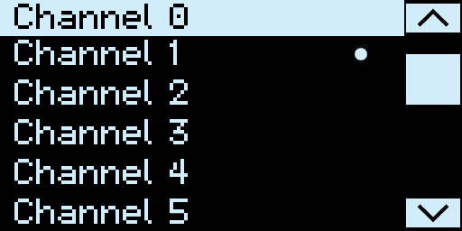  |
| Image       | 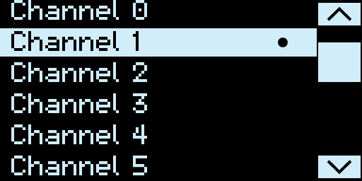  |
| Image       | 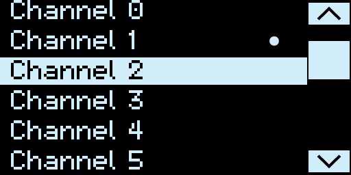  |
| Image       | 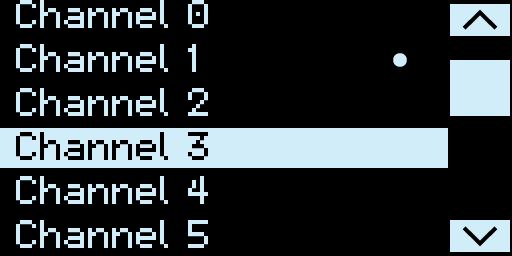  |
| Image       | 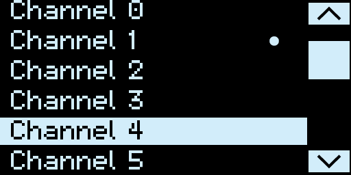  |
| Image       | 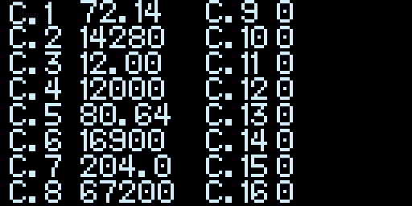  |
| Image       |   |
| Image       | 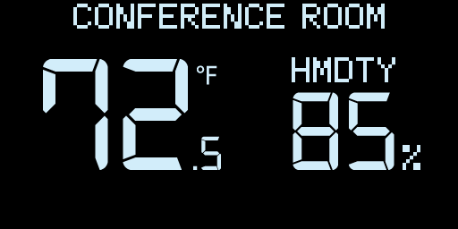  |
| Image       | 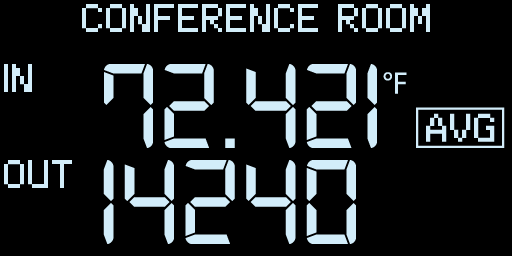  |
| Image       |  |
| Image       | 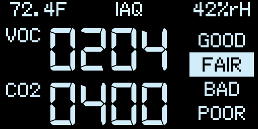 |
| Image       | 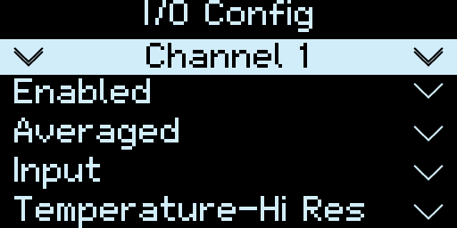 |
| Image       |  |
| Image       |  |
| Image       | 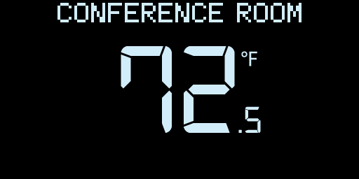 |
| Image       | 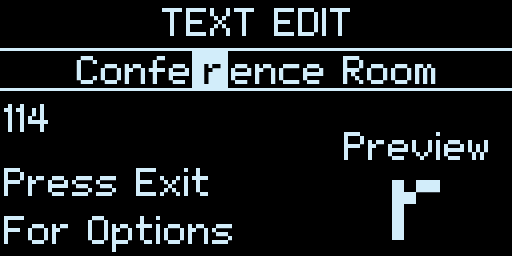 |

---

[back](../)
